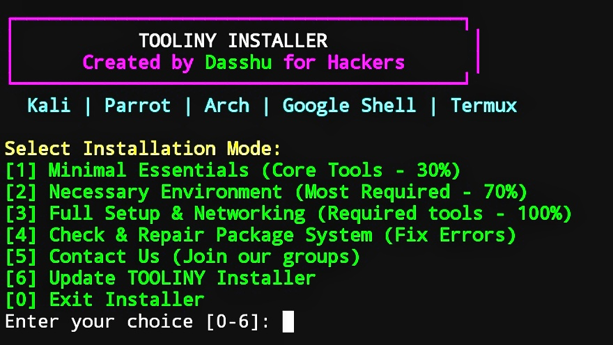

# tool-installer - Package Installer Tool

A colorful, hacker-style package installer for **Kali Linux**, **Parrot OS**, and **Termux**.  
Quickly install the most important, necessary, or full sets of tools with just one script!

---




## Features:
- [1] **Most Important** packages (top 14)
- [2] **Necessary Tools** for other scripts (20+ essential)
- [3] **Full Setup** with network analyzers and info tools

Color-coded and styled for terminal enthusiasts! by Dasshu

---

## Color Preview:

- **Red** = Alerts & Errors  
- **Green** = Success  
- **Blue** = Progress Info  
- **Yellow** = Installer Actions  
- **White** = Clean Text

---

## Installation & Usage

### 1. Install basic package for further installation
```bash
apt update && apt upgrade -y
apt install git -y
```

### 2. Clone the Repo:
```bash
git clone https://github.com/thedasshu/tool-installer
cd tool-installer
```
### 3. Check for perfect format to avoid errors
```bash
pkg install dos2unix
dos2unix install.sh
```

### 4. Run the install.sh setup. 
```bash
chmod +x install.sh
bash install.sh
```
## Join Us

**Telegram Group Chat**: [https://t.me/hackerschatbox](https://t.me/hackerschatbox)  
**WhatsApp Group Chat**: [https://chat.whatsapp.com/GAVQ00SRxfvGXwHmew4TkU](https://chat.whatsapp.com/GAVQ00SRxfvGXwHmew4TkU)

---

## Thanks for Supporting Us!

If any issue persists, feel free to contact me via Instagram or join our support groups.

### Contact Us

**Instagram**: [@thedasshu](https://instagram.com/thedasshu)  
**Telegram**: [https://t.me/thedasshu](https://t.me/thedasshu)
